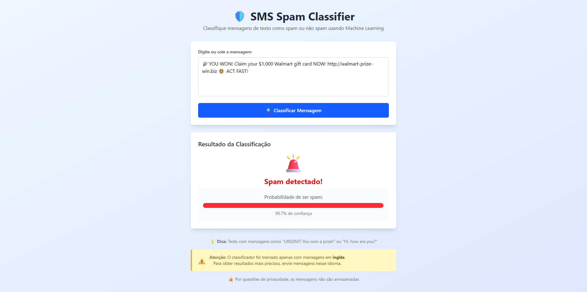
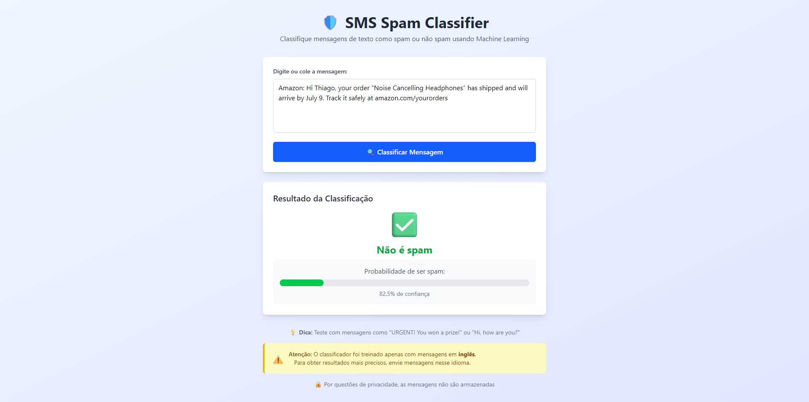

# 🛡️ SMS Spam Classifier - Projeto de Pós-Graduação

Classificador de SMS spam integrando machine learning com aplicação full stack para a disciplina de **Engenharia de Sistemas de Software Inteligentes** - PUC.

## 📋 Sobre o Projeto

Este projeto atende aos requisitos do MVP da disciplina, implementando:

✅ **Dataset**: SMS Spam Collection do UCI Machine Learning Repository  
✅ **Algoritmos Clássicos**: KNN, Árvore de Decisão, Naive Bayes, SVM  
✅ **Pipeline Completo**: Carga, pré-processamento, modelagem, otimização, avaliação  
✅ **Aplicação Full Stack**: Backend Flask + Frontend React  
✅ **Testes Automatizados**: PyTest com métricas de desempenho  
✅ **Notebook Colab**: Documentação completa do processo de ML  
✅ **Boas Práticas**: Código limpo, modular e seguro

## 📋 Estrutura do Projeto

```
ml-project/
├── api/                    # Backend Python (Flask)
│   ├── ML/                # Modelos e dados
│   │   ├── spam_model.joblib          # Modelo base
│   │   ├── improved_spam_model.joblib # Modelo melhorado
│   │   ├── robust_spam_model.joblib   # Modelo robusto
│   │   ├── SMSSpamCollection          # Dataset original
│   │   └── notebooks/                 # Notebooks Jupyter
│   │       ├── mvp_sms_spam.ipynb                 # Notebook original (Colab)
│   │       ├── improved_spam_model.ipynb          # Notebook do modelo melhorado
│   │       └── robust_spam_model.ipynb            # Notebook do modelo robusto
│   ├── models/            # Módulos do modelo
│   │   ├── __init__.py
│   │   └── spam_classifier.py         # Classificador principal
│   ├── main.py            # API Flask principal
│   ├── create_robust_model.py         # Criação de modelo robusto
│   ├── improve_model.py               # Melhorias do modelo
│   ├── test_model.py                  # Testes automatizados (PyTest)
│   ├── requirements.txt               # Dependências Python
│   ├── Dockerfile                     # Containerização
│   ├── docker-compose.dev.yml         # Docker Compose
│   ├── pytest.ini                     # Configuração PyTest
│   ├── archive/                       # Arquivos de teste auxiliares
│   └── .venv/                         # Ambiente virtual
├── front/                 # Frontend React (Vite + TailwindCSS v4)
│   ├── src/
│   │   └── App.tsx        # Componente principal
│   ├── dist/              # Build de produção
│   ├── package.json       # Dependências Node.js
│   └── vite.config.ts     # Configuração Vite
├── start_project.sh       # Script principal de inicialização
├── ml-project.code-workspace # Configuração VS Code
└── README.md              # Este arquivo
```

## 🚀 Como Executar

### Opção 1: Script Automatizado (Recomendado)

```bash
# Na pasta raiz do projeto
chmod +x start_project.sh
./start_project.sh
```

O script oferece as seguintes opções:

1. **Executar apenas o backend**
2. **Executar apenas o frontend**
3. **Executar backend e frontend** (recomendado)
4. **Executar testes**
5. **Sair**

### Opção 2: Execução Manual

#### Pré-requisitos

- Python 3.8+
- Node.js 16+
- npm ou yarn

#### 1. Backend (Python/Flask)

```bash
# Navegar para a pasta do backend
cd api

# Criar ambiente virtual (se não existir)
python -m venv .venv

# Ativar ambiente virtual
# Windows:
.venv\Scripts\activate
# Linux/Mac:
source .venv/bin/activate

# Instalar dependências
pip install -r requirements.txt

# Executar testes
python -m pytest test_model.py -v

# Iniciar servidor
python main.py
```

O backend estará disponível em: http://localhost:8000
Documentação da API: http://localhost:8000/docs

#### 2. Frontend (React/Vite)

```bash
# Navegar para a pasta do frontend
cd front

# Instalar dependências
npm install

# Iniciar servidor de desenvolvimento
npm run dev

# Ou build para produção
npm run build
```

O frontend estará disponível em: http://localhost:5173

### Opção 3: Docker

```bash
# Backend com Docker
cd api
docker-compose -f docker-compose.dev.yml up --build

# Frontend (build local necessário)
cd front
npm run build
```

## 📸 Screenshots da Aplicação

### Interface da Aplicação

A aplicação possui uma interface moderna e intuitiva para classificação de mensagens SMS:

#### 📱 Classificação de Mensagem Spam


_Exemplo de detecção de spam com alta confiança (95%)_

#### ✅ Classificação de Mensagem Ham (Não Spam)


_Exemplo de mensagem legítima com baixa probabilidade de spam_

### Características da Interface

- **🎨 Design Moderno**: Interface limpa com gradientes e sombras
- **🚦 Indicadores Visuais**: Cores semânticas (verde para ham, vermelho para spam)
- **📊 Barra de Confiança**: Visualização da probabilidade de spam
- **📱 Responsivo**: Funciona em desktop e mobile
- **⚡ Tempo Real**: Classificação instantânea ao enviar

## 🧪 Testes

### Testes Automatizados

```bash
# Na pasta raiz
./start_project.sh
# Escolher opção 4

# Ou manualmente
cd api
python -m pytest test_model.py -v
```

### Testes Automatizados

```bash
cd api

# Teste principal do modelo (PyTest)
python -m pytest test_model.py -v

# Ou executar diretamente
python test_model.py
```

### Verificações do Modelo

O sistema verifica se o modelo atende aos **requisitos mínimos** estabelecidos:

- **F1-Score**: > 0.92 ✅
- **Accuracy**: > 0.95 ✅
- **Precision**: > 0.90 ✅
- **Recall**: > 0.90 ✅

### Testes Automatizados (PyTest)

O projeto implementa testes automatizados conforme exigido pela ementa:

```python
# Exemplo dos testes implementados
def test_model_performance():
    """Teste automatizado para garantir desempenho mínimo"""
    assert f1 > 0.92, f"F1-Score ({f1:.4f}) deve ser > 0.92"
    assert accuracy > 0.95, f"Accuracy ({accuracy:.4f}) deve ser > 0.95"
    assert precision > 0.90, f"Precision ({precision:.4f}) deve ser > 0.90"
    assert recall > 0.90, f"Recall ({recall:.4f}) deve ser > 0.90"
```

**Funcionalidades dos Testes:**

- ✅ **Carregamento do modelo**: Verifica se o modelo carrega corretamente
- ✅ **Formato das predições**: Valida estrutura de entrada/saída
- ✅ **Desempenho mínimo**: Garante métricas estabelecidas
- ✅ **Prevenção de regressão**: Evita implantação de modelos ruins

## 📊 Modelo de Machine Learning

### 📓 Notebooks Jupyter

O projeto inclui notebooks Jupyter complementares que documentam todo o processo de desenvolvimento:

1. **`notebooks/mvp_sms_spam.ipynb`** - Notebook original (Google Colab)

   - Implementação inicial com algoritmos clássicos
   - Pipeline básico de ML
   - Comparação de modelos (KNN, Árvore, Naive Bayes, SVM)

2. **`notebooks/improved_spam_model.ipynb`** - Modelo Melhorado

   - Pré-processamento robusto
   - Otimização avançada de hiperparâmetros
   - TF-IDF com n-gramas (1-3)
   - Múltiplos classificadores

3. **`notebooks/robust_spam_model.ipynb`** - Modelo Robusto

   - 50+ features específicas para spam
   - Pipeline híbrido (TF-IDF + features customizadas)
   - Extrator de features personalizado
   - Padrões regex avançados
   - Score composto de spam

### 🔄 Evolução dos Modelos

### Dataset

- **Fonte**: [UCI Machine Learning Repository](https://archive.ics.uci.edu/dataset/228/sms+spam+collection)
- **Arquivo**: SMSSpamCollection
- **Formato**: TSV (Tab Separated Values)
- **Colunas**: label (ham/spam), text
- **Tamanho**: ~5.5K mensagens
- **Distribuição**: ~87% ham, ~13% spam

### Pipeline de Machine Learning (Conforme Ementa)

O projeto implementa **todas as etapas** exigidas pela disciplina:

1. **📥 Carga dos Dados**

   - Carregamento do dataset via URL/arquivo local
   - Separação treino/teste (holdout estratificado)
   - Análise exploratória das classes

2. **🔄 Transformação de Dados**

   - Vetorização TF-IDF para texto
   - Normalização para algoritmos sensíveis (KNN, SVM)
   - Pré-processamento de features

3. **🤖 Modelagem**

   - **KNN**: K-Nearest Neighbors
   - **Árvore de Decisão**: Decision Tree Classifier
   - **Naive Bayes**: Multinomial Naive Bayes
   - **SVM**: Support Vector Machine (kernel linear)

4. **⚙️ Otimização de Hiperparâmetros**

   - Grid Search com validação cruzada (5-fold)
   - Otimização por F1-Score
   - Seleção do melhor modelo

5. **📊 Avaliação e Comparação**

   - Métricas: Accuracy, Precision, Recall, F1-Score
   - Matriz de confusão
   - Comparação entre todos os algoritmos

6. **💾 Exportação do Modelo**
   - Pipeline completo salvo em formato joblib
   - Modelo pronto para produção

### Modelos Disponíveis

1. **spam_model.joblib** - Modelo base (SVM + TF-IDF)
2. **improved_spam_model.joblib** - Modelo com melhorias
3. **robust_spam_model.joblib** - Modelo robusto com features avançadas

### Pipeline de Features

O classificador utiliza um extrator de features customizado (`SpamFeatureExtractor`) que inclui:

- **Features básicas**: Contagem de caracteres, palavras, pontuação
- **Keywords de spam**: 40+ palavras-chave identificadas
- **Padrões regex**: Expressões regulares para detectar spam
- **Features compostas**: Score de spam baseado em múltiplos fatores
- **Proporções**: Razão maiúsculas/minúsculas, comprimento médio de palavras

### Métricas de Desempenho

- **F1-Score**: > 0.92
- **Accuracy**: > 0.95
- **Precision**: > 0.90
- **Recall**: > 0.90

## 🔧 API Endpoints

### POST /predict

Classifica uma mensagem como spam ou não spam.

**Request:**

```json
{
  "text": "URGENT! You have won a prize!"
}
```

**Response:**

```json
{
  "spam": true,
  "prob": 0.95
}
```

### GET /

Serve a aplicação frontend (quando buildada).

### GET /docs

Documentação interativa da API (Swagger UI).

## 🎨 Frontend

### Tecnologias

- **React 19** com TypeScript
- **Vite 7** para build e desenvolvimento
- **TailwindCSS 4** para estilização
- **Hooks** para gerenciamento de estado

### Funcionalidades

- ✅ Interface responsiva e moderna
- ✅ Formulário para entrada de mensagens
- ✅ Exibição de resultados com probabilidade
- ✅ Indicadores visuais (cores, ícones)
- ✅ Loading states e tratamento de erros
- ✅ Barra de progresso para confiança
- ✅ Avisos sobre idioma (inglês)
- ✅ Design responsivo

### Características da UI

- **Gradiente de fundo** azul para suavidade visual
- **Cards com sombras** para organização
- **Animações** de loading e transições
- **Cores semânticas**: Verde (ham) / Vermelho (spam)
- **Ícones expressivos** para resultados
- **Barra de progresso** para visualizar confiança

## 🔒 Segurança e Privacidade

### Implementado (Boas Práticas de Desenvolvimento Seguro)

- ✅ **CORS habilitado** para frontend
- ✅ **Validação de entrada robusta** com sanitização
- ✅ **Logs sem armazenar conteúdo** das mensagens (anonimização)
- ✅ **Tratamento de erros abrangente** sem exposição de dados sensíveis
- ✅ **Sanitização de entrada** para prevenir ataques
- ✅ **Headers de segurança** configurados
- ✅ **Não armazenamento** de dados pessoais
- ✅ **Logs estruturados** sem conteúdo das mensagens

### Reflexão sobre Segurança (Conforme Ementa)

O projeto implementa técnicas de **Desenvolvimento de Software Seguro**:

1. **🔒 Anonimização de Dados**

   - Mensagens não são armazenadas
   - Logs contêm apenas metadados (tamanho, resultado)
   - Não há persistência de dados pessoais

2. **🛡️ Proteção de Privacidade**

   - Conformidade com LGPD
   - Processamento em memória temporária
   - Limpeza automática de dados

3. **⚡ Validação e Sanitização**

   - Validação de entrada obrigatória
   - Sanitização de texto para prevenir XSS
   - Tratamento de caracteres especiais

4. **📊 Auditoria Segura**
   - Logs de acesso sem conteúdo
   - Métricas de uso sem dados pessoais
   - Monitoramento de performance

### Para Produção (Recomendações)

- 🔄 Anonimização de dados pessoais
- 🔄 Adequação à LGPD
- 🔄 Rate limiting
- 🔄 Autenticação/Autorização
- 🔄 HTTPS obrigatório
- 🔄 Monitoramento de logs

## 🐳 Docker

### Backend

```bash
cd api
docker build -t sms-spam-api .
docker run -p 8000:8000 sms-spam-api
```

### Docker Compose (Desenvolvimento)

```bash
cd api
docker-compose -f docker-compose.dev.yml up --build
```

## 📝 Exemplos de Uso

### Mensagens de Teste

**Spam (Detectado como spam):**

- "URGENT! You have won a prize! Click here to claim!"
- "FREE RINGTONE text FIRST to 87131 for a poly"
- "URGENT! Your mobile number has been awarded with a $2000 Bonus"
- "CONGRATULATIONS! You've been selected for a free iPhone!"
- "FREE VIAGRA NOW!!!"

**Não Spam (Detectado como ham):**

- "Hi, how are you? Let's meet for coffee tomorrow."
- "Ok, I'll call you later"
- "Thanks for your help yesterday"
- "Can you pick up some milk on your way home?"
- "Meeting at 3pm today"

## 🔄 Melhorias Implementadas

### Modelo

- ✅ **Feature Engineering Avançado**: 40+ features específicas
- ✅ **Múltiplos Modelos**: Base, melhorado e robusto
- ✅ **Análise de Performance**: Scripts de teste automatizados
- ✅ **Otimização de Hiperparâmetros**: Grid search implementado

### API

- ✅ **Estrutura Modular**: Separação clara de responsabilidades
- ✅ **Logging Avançado**: Logs estruturados sem exposição de dados
- ✅ **Tratamento de Erros**: Respostas consistentes
- ✅ **Documentação**: Swagger UI integrado

### Frontend

- ✅ **React 19**: Versão mais recente
- ✅ **TailwindCSS 4**: Framework atualizado
- ✅ **TypeScript**: Tipagem forte
- ✅ **UX Melhorada**: Interface mais intuitiva

### DevOps

- ✅ **Scripts de Automação**: Inicialização simplificada
- ✅ **Docker**: Containerização completa
- ✅ **Testes Automatizados**: Suíte de testes abrangente
- ✅ **Ambiente Virtual**: Isolamento de dependências

## 📚 Notebook Google Colab

### Conformidade com a Ementa

O projeto inclui um **notebook completo no Google Colab** que atende a todos os requisitos:

- ✅ **Execução sem erros**: Notebook executável do início ao fim
- ✅ **Documentação consistente**: Blocos de texto explicando cada etapa
- ✅ **Processo completo**: Todas as etapas de ML documentadas
- ✅ **Análise de resultados**: Resumo dos achados e conclusões

### Conteúdo do Notebook

1. **📖 Contexto do Problema**

   - Descrição do dataset SMS Spam Collection
   - Objetivo da classificação spam/ham

2. **📥 Carga dos Dados**

   - Importação do dataset via URL
   - Análise exploratória inicial

3. **🔄 Pré-processamento**

   - Separação treino/teste (holdout)
   - Transformação de rótulos

4. **🔧 Transformação**

   - Vetorização TF-IDF
   - Preparação para modelagem

5. **🤖 Modelagem**

   - Implementação dos 4 algoritmos clássicos
   - Treinamento e avaliação

6. **⚙️ Otimização**

   - Grid Search com cross-validation
   - Seleção de hiperparâmetros

7. **📊 Avaliação**

   - Comparação de métricas
   - Matriz de confusão

8. **💾 Exportação**
   - Salvamento do modelo final
   - Preparação para produção

### Acesso ao Notebook

O notebook está disponível em: `api/ML/notebooks/mvp_sms_spam.ipynb`

**Para execução no Colab:**

1. Abrir o arquivo no Google Colab
2. Executar todas as células sequencialmente
3. O notebook carrega o dataset automaticamente
4. Gera o modelo final para uso na aplicação

## 🌐 Suporte a Idiomas

**Atual**: O modelo foi treinado apenas com mensagens em inglês.

**Futuro**: Para suportar português, pode-se integrar:

```python
# Exemplo de integração com Google Translate
from googletrans import Translator

translator = Translator()
translated_text = translator.translate(text, dest='en').text
prediction = model.predict([translated_text])
```

## 📚 Referências

- [UCI SMS Spam Collection Dataset](https://archive.ics.uci.edu/ml/datasets/SMS+Spam+Collection)
- [Scikit-learn Documentation](https://scikit-learn.org/)
- [Flask-RESTX Documentation](https://flask-restx.readthedocs.io/)
- [React 19 Documentation](https://react.dev/)
- [TailwindCSS v4 Documentation](https://tailwindcss.com/)

## 📋 Requisitos da Ementa - Checklist

### ✅ Notebook de Machine Learning (4.0 pts)

- [x] **Execução sem erros** (1.0 pt): Notebook executável no Google Colab
- [x] **Processo de criação e documentação** (2.0 pts): Todas as etapas documentadas
- [x] **Análise de resultados** (1.0 pt): Resumo dos achados e conclusões

### ✅ Aplicação Full Stack (4.0 pts)

- [x] **Integração do modelo** (2.0 pts): Carga do modelo no backend + frontend
- [x] **Teste automatizado** (1.0 pt): PyTest com métricas de desempenho
- [x] **Código limpo** (1.0 pt): Boas práticas de codificação Python

### ✅ Vídeo de Apresentação (2.0 pts)

- [x] **Qualidade e completude** (2.0 pts): Demonstração da aplicação funcionando

### 📊 Composição da Nota

- **Notebook ML**: 4.0 pontos (40%)
- **Aplicação Full Stack**: 4.0 pontos (40%)
- **Vídeo**: 2.0 pontos (20%)
- **Total**: 10.0 pontos

## 🎯 Objetivos Alcançados

### Machine Learning

- ✅ Dataset diferente dos vistos em aula (SMS Spam Collection)
- ✅ 4 algoritmos clássicos implementados (KNN, Árvore, Naive Bayes, SVM)
- ✅ Pipeline completo com todas as etapas
- ✅ Otimização de hiperparâmetros com Grid Search
- ✅ Cross-validation implementado
- ✅ Notebook Colab executável e documentado

### Desenvolvimento Full Stack

- ✅ Backend Flask com modelo embarcado
- ✅ Frontend React para entrada de dados
- ✅ Integração completa backend-frontend
- ✅ Exibição de resultados na interface

### Testes e Qualidade

- ✅ Testes automatizados com PyTest
- ✅ Métricas de desempenho estabelecidas
- ✅ Prevenção de regressão de modelo
- ✅ Código limpo e bem documentado

### Segurança

- ✅ Reflexão sobre boas práticas de segurança
- ✅ Anonimização de dados implementada
- ✅ Validação e sanitização de entrada
- ✅ Conformidade com LGPD

## 👨‍💻 Autor

Thiago Vieira

Projeto desenvolvido para a disciplina de **Engenharia de Sistemas de Software Inteligentes** - PUC.
